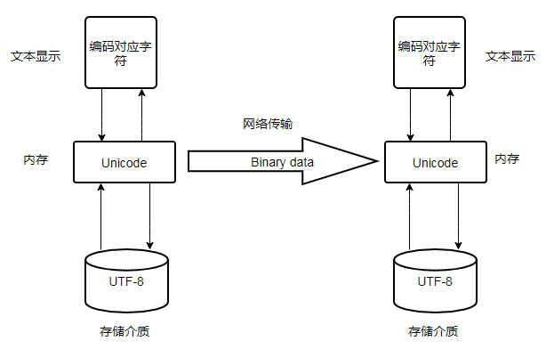

# Python中编码问题   
#### 作者:coresu  
#### 时间:2019-11-1  
# 
### 文章由来：  
在大学时候自学了Python，还记得当时自学的Python 2.X版本，正巧跟着导师做了一些项目也参加了一些省级、国家级的比赛项目。   

- 由衷的感叹：比赛真的很锻炼人，在比赛的过程中可以快速成长！   
- 由衷的感谢:我的大学导师带我真正走进了coding的大门！   
   
言归正传，当时在做爬虫的时候，反复的被Python 2.X的编码问题困扰，普爬取下来的内容很多都是乱码，而且，在后期从Python 2向Python 3转的时候发现也存在很多的不同。时隔多年，赶巧有一位同实验室的学弟问了我一个爬虫上的问题。引起了我想好好总结一番Python编码问题的想法。   


### 编码之间的差异   
计算机由美国发明，因此英语的使用在计算机中占据了重要的地位     

- 最初的计算机编码格式为ASCII编码格式，所有的CS（computer scientific）专业的学生一定见过大名鼎鼎的SCII码表。在ASCII码变种更可以看出，这种编码格式中只含英文字母、数字、标点符号三种类型。  
- 随着互联网的不算发展，越来越多的国家加入计算机的阵营，越来越多的语言涌入计算机中，原有的ASCII编码格式已经难以满足人们的需求，因此诞生了Unicode编码格式，这种编码格式避免ASCII中仅使用一个字节来标识一个ASCII，一个字节8位--最大容量2的8次幂为256，仅保持256个字符的弊病。Unicode编码在记得计算机组成原理中给出的解释是通常使用2个字节（也可以跟多字节）来标识一个文字，经过[廖雪峰](https://baike.baidu.com/item/廖雪峰/22728717?fr=aladdin)老师的实测说：汉字一般使用3个字节来表示，个人倾向于廖老师的说法，毕竟实践出真知吗，也可以使用更多的字节来标识更多的文字，这样就解决了随着计算机的发展某些字符无法被显示的问题。   

- 互联网继续发展，人们发现使用定长的Unicode来标识一个字符的话，这样就太浪费空间了。所以为了优化存储空间，人们想出了UTF-8变长Unicode编码格式。例如：一个英文字母'A'便可以适应一个字节来存储，'好'字便可使用三个字节来标识。在互联网中，采用UTF-8格式的居多，这样讲大大降低传输成本。  
     - 为什么变成编码格式没优化处理？因为计算机操作在内存中真正处理的是单个字节单个字节进程处理的，无论编码什么格式的字符，计算机都将其拆解成单个字符来进行处理，因此变长编码格式仅是优化存储与传输效率。  
     - 


### Python 2版本  
Python2的默认编码为ascii

在Python2中解释器以声明的编码格式解析源代码，我们如果遇到的是Unicode字符串会原样输出，如果遇到的是字符串则会解码程Unicode的方式再输出。本质上做了一次将多个字节拆解成个字节的工作，但是拆解后的字符将失去原有的意义导致编码错误问题。   

解释器声明的编码从何而来？解释器声明的编码依据不同的编辑工具不同而不同。

- Windows的默认编码为GBK;   
- MAC的默认编码为UTF-8;   
- Sublime text默认且仅支持编码UTF-8;  
- Pycharm默认编码为ascii。

解决此问题的好方法就是在头部声明以什么样的字符集来进行存储。  
```
# -*- coding: utf-8 -*-   

或者

# coding:utf-8
```
在编写Python源代码文本时，首行通常我们都添加一注释。这行注释在Python解析器读取文本的时，我们指定编译器以UTF-8变长的编码格式的方式读取Python源代码。


### Python 3版本
Python 3版本在一定程度上解决了Python2版本的编码问题，3版本的默认编码为UTF-8，且字符串默认类型都是str类型。


### 常用字符集与方法解释   

方法：  

在Python2中经常会碰到，使用方法转换字符集类型的情况，总结表格如下  

| 编码格式 | 【转换方向】 | 转换方法 | 【转换方向】 | 编码格式 |
| :---: | :---: | :---: | :---: | :---: |
| Unicode | ----> | encode() | ----> | UTF-8/GBK |  
| UTF-8/GBK | ----> | encode() | ----> | Unicode |


*  decode()：此方法是将Unicode编码格式转换成UTF-8/GBK编码格式，简称解码；

*  encode()：此方法是将UTF-8/GBK编码格式转换成Unicode编码格式，简称编码；

*  decode('unicode-escape')：解码中的一种，作用是将得到的‘内容为unicode字符串’（如：'\u53eb\u6211'）编译成可识别的汉字；

*  setdefaultencoding（）：设置默认编码格式，一般在Python2版本下使用，Python3版本的sys包已经废弃了此方法。
```
import sys  
reload(sys)
sys.setdefaultencoding("utf-8")
```


编码：  

- ASCII：由美国国家标准学会（ANSI）制定，处理不同的字母、数字、符号； 
- Unicode（万国码）： 采用多字节形式，容纳跟多语言文字的统一编码格式； 
- ISO-8859-1(别名Latin1)：单字节标识字符向下兼容ASCII编码，但不包含中文，多是西欧国家语言。
- GB2312：两字节编码、涵盖简体中文、中国规定的字符集；
- GBK：拓展了GB2312，容纳了繁体中文字符； 
- UTF-8：可以节省空间的万国码（Unicode）；


#  
##### 参考文章  
[alpha_panda博客](https://www.cnblogs.com/yssjun/p/9782400.html)  
[参考廖雪峰老师文章原址](https://www.liaoxuefeng.com/wiki/1016959663602400/1017075323632896)   


