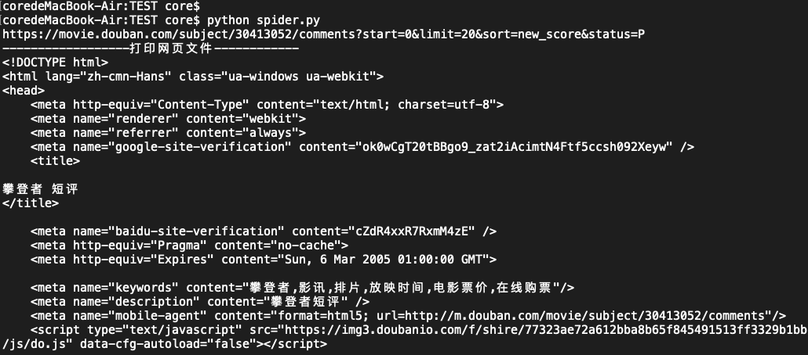

# 豆瓣爬虫出现乱码   
### 作者:coresu  
### 时间:2019-10-21   


### 爬虫简介：
爬取豆瓣评论相关信息，以便提高自己的技术。在使用Chrome审查了源代码后，正常获取无乱码情况，且发现此网页爬取相对简单，并不涉及ajax动态响应。 

### 爬取思路：
使用requests包获取和HTML网页源文件使用Xpath对DOM进行解析，实现将所需元素抽离、整理直至最后保存为CSV文件。


### 问题爆发点：
在获取网页源代码的时候获取到的代码总是乱码，最初以为是字符集原因导致的，但经过多次尝试后发现并不是字符集导致的，而是在使用headers模拟请求头访问时，设置了'Accept-Encoding':'gzip, deflate, br'，此参数表示将数据已压缩的方式传输，为了减少后网络传输数据量，提高反馈速率，HTTP采用通用的压缩算法gzip来压缩HTML,Javascript, CSS文件，且无形之中特提供了一种反爬取功能。HTTP压缩是HTTP编码的一种，是服务器和浏览器之间传输文本内容的一种方法。

### 乱码脚本DoubanSpider.py
```shell
# encoding=utf8

import sys
reload(sys)
sys.setdefaultencoding('utf8')
import requests
import time
from lxml import etree


import io

url = 'https://movie.douban.com/subject/30413052/comments?start=%d&limit=20&sort=new_score&status=P'


headers={'Accept':'text/html,application/xhtml+xml,application/xml;q=0.9,image/webp,image/apng,*/*;q=0.8,application/signed-exchange;v=b3',
'Accept-Encoding':'gzip, deflate, br',
'Accept-Language':'zh-CN,zh;q=0.9',
'Cache-Control':'max-age=0',
'Connection':'keep-alive',
'Cookie':'bid=hGPYYnU9JLM; __utmc=30149280; push_noty_num=0; push_doumail_num=0; dbcl2="196399371:puywehE7c/Q"; ck=8hwC; _pk_ref.100001.8cb4=%5B%22%22%2C%22%22%2C1571563739%2C%22https%3A%2F%2Faccounts.douban.com%2Fpassport%2Flogin%22%5D; _pk_id.100001.8cb4=c12ba9042a841c39.1571563739.1.1571563739.1571563739.; _pk_ses.100001.8cb4=*; __yadk_uid=hTgwuCazczyCDCLv4G9BaerjQYdHKjxy; __utma=30149280.791093345.1571551187.1571553965.1571563744.3; __utmz=30149280.1571563744.3.2.utmcsr=accounts.douban.com|utmccn=(referral)|utmcmd=referral|utmcct=/passport/login; __utmt=1; __utmv=30149280.19639; __utmb=30149280.2.10.1571563744',
'Host':'movie.douban.com',
'Referer':'https://movie.douban.com/subject/30413052/',
'Sec-Fetch-Mode':'navigate',
'Sec-Fetch-Site':'same-origin',
'Sec-Fetch-User':'?1',
'Upgrade-Insecure-Requests':'1',
'User-Agent':'Mozilla/5.0 (Windows NT 10.0; Win64; x64) AppleWebKit/537.36 (KHTML, like Gecko) Chrome/77.0.3865.120 Safari/537.36}',}
if __name__ == '__main__':
    fp = io.open('./climb.csv', mode='w', encoding='utf-8')
    fp.write(unicode('author\tcomment\tvote\n'))
    for i in range(26):
        if i==25:
            url_climb=url%(50)
        else:
            url_climb =url%(i*2)
            print url_climb
        response = requests.get(url_climb, headers=headers)
        response.encoding = 'utf-8'
        text = response.text
        html = etree.HTML(text)
        # comments=html.xpath('//div[@id="commentsprint url_climb"]/div[@class="comment-item"]')
        comments = html.xpath("//div[@class='article']/div[@id='comments']/div[@class='comment-item']")
        print comments

        for index, comment in enumerate(comments):
            print index

            # 爬取作者名
            auth_nu = '//div[@class="comment-item"][%d]/div[@class="avatar"]/a/@title' % (index + 1)
            author = html.xpath(auth_nu)[0].strip()
            print author

            # 爬取评论内容
            comm_nu = '//div[@class="comment-item"][%d]/div[@class="comment"]/p' % (index + 1)
            comm_text_sub = html.xpath(comm_nu)[0]
            comm_text = comm_text_sub.xpath('string(.)').strip()
            print comm_text

            # 爬取评论数
            vote_nu = '//div[@class="comment-item"][%d]/div[@class="comment"]/h3/span[@class="comment-vote"]/span[@class="votes"][1]/text()' % (index + 1)
            vote = html.xpath(vote_nu)[0]
            print int(vote)
            
            fp.write('%s\t%s\t%s\n' % (author, comm_text, vote))
            print('爬取成功第%d条--Bingo' % (index + 1))
            time.sleep(2)
        fp.close()
```
## headers设置压缩参数运行出错  


## 在headers中注释压缩


## 重新运行脚本DoubanSpider.py  
运行后控制台（terminal）打印效果
  

保存CSV文件后部分效果图
  

获取完整爬取脚本[完整脚本DoubanSpider.py](./DoubanSpider.py)


